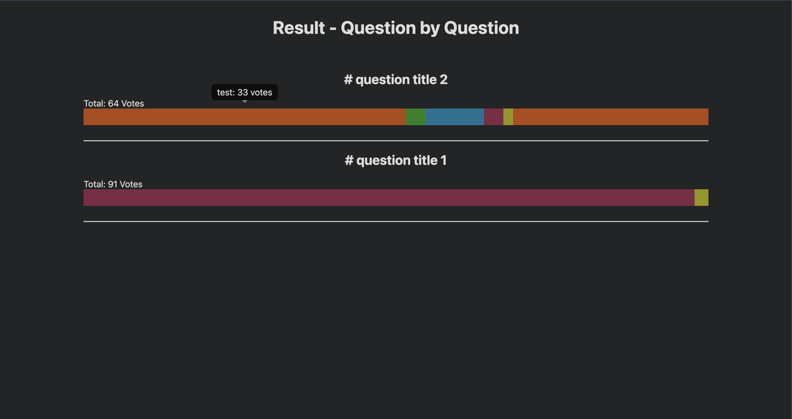

# polls
flask polls app with many options and optional blocking for multiple votes from one host

# Warning:
currently sheet support only in type2 surveys
in qbq only json is supported
working currently on making everything for the json file mode
-> sheet mode wont work currently

## Images

## Installation
#### Nginx Deployment
move the folder to /opt/survey
configure (user) polls.service and place it in the /ect/systemd/system/ files
with matching user 

nginx install + site config for running the socket
look it up in the internet

certbot for nginx

#### Debug Run
Debugging: run the app.py file directly

#### configuration
sqlite3 into the data/accounts.db and remove the raphiel user

## Contributing
Issues: <a href="https://codeberg.org/slayernominee/polls/issues">Open an Issue on Codeberg</a> 
Code Contributions: <a href="https://codeberg.org/slayernominee/polls">Make a Pull Reqeust on Codeberg</a> 
Other Stuff: Just open an Issue on Codeberg and tell me how you want to contribute 

## Credits
#### Radio Buttons
<a href="https://www.w3schools.com/howto/howto_css_custom_checkbox.asp">W3Schools</a>

#### Text Buttons
<a href="https://www.w3schools.com/css/css_form.asp">W3Schools</a>

#### Background Style (inspired)
<a href="https://codepen.io/P1N2O/pen/pyBNzX">Manuel Pinto</a>

#### DarkMode
<a href="https://github.com/darkreader/darkreader">DarkReader</a>
